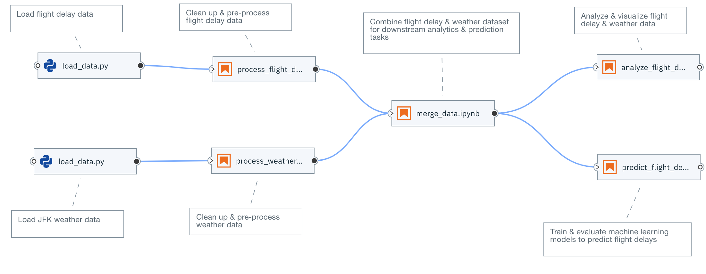
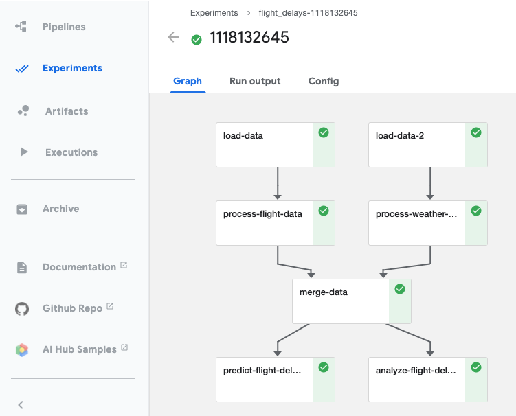
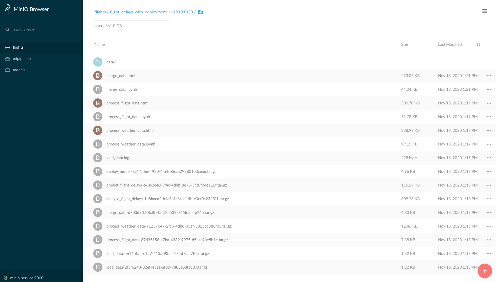

# Analyzing flight delay and weather data

This repository contains a set of Python scripts and Jupyter notebooks that analyze and predict flight delays. The datasets are hosted on the [IBM Developer Data Asset Exchange](ibm.biz/data-exchange).

We use [Elyra](https://github.com/elyra-ai/elyra) to create a pipeline that can be executed locally or using a [Kubeflow Pipelines](https://www.kubeflow.org/docs/pipelines/overview/pipelines-overview/) runtime. This pipeline:

* Loads the datasets
* Pre-processes the datasets
* Performs data merging and feature extraction
* Analyzes and visualizes the processed dataset
* Trains and evaluates machine learning models for predicting delayed flights, using features about flights as well as related weather features



### Configuring the local development environment

It's highly recommended to create a dedicated and consistent Python environment for running the notebooks in this repository:

1. Install [Anaconda](https://docs.anaconda.com/anaconda/install/)
   or [Miniconda](https://docs.conda.io/en/latest/miniconda.html)
1. Navigate to your local copy of this repository.
1. Create an Anaconda environment from the `yaml` file in the repository:
    ```console
    $ conda env create -f flight-delays-env.yaml
    ```
1. Activate the new environment:
    ```console
    $ conda activate flight-delays-env
    ```
1. If running JupyterLab and Elyra for the first time, build the extensions:
    ```console
    $ jupyter lab build
    ```
1. Launch JupyterLab:
    ```console
    $ jupyter lab
    ```

### Configuring a local Kubeflow Pipeline runtime

[Elyra's Notebook pipeline visual editor](https://elyra.readthedocs.io/en/latest/getting_started/overview.html#notebook-pipelines-visual-editor)
currently supports running these pipelines in a Kubeflow Pipeline runtime.  If required, these are
[the steps to install a local deployment of KFP](https://elyra.readthedocs.io/en/latest/recipes/deploying-kubeflow-locally-for-dev.html).

After installing your Kubeflow Pipeline runtime, use the command below (with proper updates) to configure the new
KFP runtime with Elyra.

```bash
elyra-metadata install runtimes --replace=true \
       --schema_name=kfp \
       --name=kfp_local \
       --display_name="Kubeflow Pipeline (local)" \
       --api_endpoint=http://[host]:[api port]/pipeline \
       --cos_endpoint=http://[host]:[cos port] \
       --cos_username=[cos username] \
       --cos_password=[cos password] \
       --cos_bucket=flights
```

**Note:** The cloud object storage above is a local minio object storage but other cloud-based object storage services could be configured and used in this scenario.

If using the default minio storage - following the local Kubeflow installation instructions above - the arguments should be `--cos_endpoint=http://minio-service:9000`, `--cos_username=minio`, `--cos_password=minio123`.

Similarly, the KFP api endpoint would be `--api_endpoint=http://127.0.0.1:31380/pipeline`.

**Don't forget to setup port-forwarding for the KFP ML Pipelines API service and Minio service as per the above instructions.**

## Elyra Notebook pipelines

Elyra provides a visual editor for building Notebook-based AI pipelines, simplifying the conversion of 
multiple notebooks into batch jobs or workflows. By leveraging cloud-based resources to run their 
experiments faster, the data scientists, machine learning engineers, and AI developers are then more productive,
allowing them to spend their time using their technical skills.


### Running the Elyra pipeline

The Elyra pipeline `flight_delays.pipeline`, which is located in the `pipelines` directory, can be run by clicking
on the `play` button as seen on the image above. The `submit` dialog will request two inputs from the user: a name 
for the pipeline and a runtime to use while executing the pipeline.

The list of available runtimes comes from the registered Kubeflow Pipelines runtimes documented above and includes a `Run in-place locally` option for local execution. After submission, Elyra will show a dialog with a direct link to where the experiment is being executed on Kubeflow Piplines.

The user can access the pipelines, and respective experiment runs, via the `api_endpoint` of the Kubeflow Pipelines
runtime (e.g. `http://[host]:[port]/pipeline`)



The output from the executed experiments are then available in the associated `object storage`
and the executed notebooks are available as native `.ipynb` notebooks and also in `html` format
to facilitate the visualization and sharing of the results.




### Running the Elyra pipeline with model deployment to Kubeflow Serving

Please follow the [instructions](kfserving.md) for running the pipeline `flight_delays_with_deployment.pipeline`, which adds a node at the end of the pipeline for deploying the model to [KFServing](https://www.kubeflow.org/docs/components/serving/kfserving/).

### References

Find more project details on [Elyra's GitHub](https://github.com/elyra-ai/elyra) or watching the
[Elyra's demo](https://www.youtube.com/watch?v=Nj0yga6T4U8).