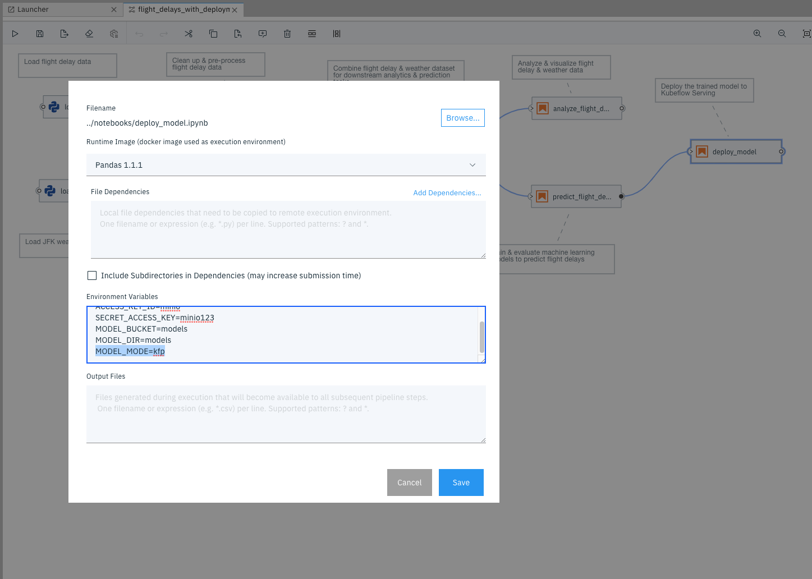
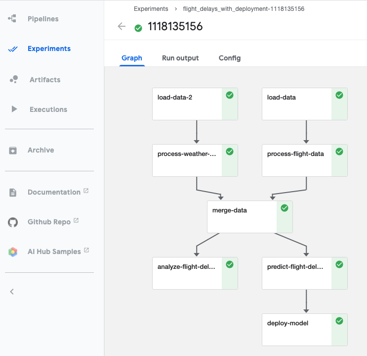
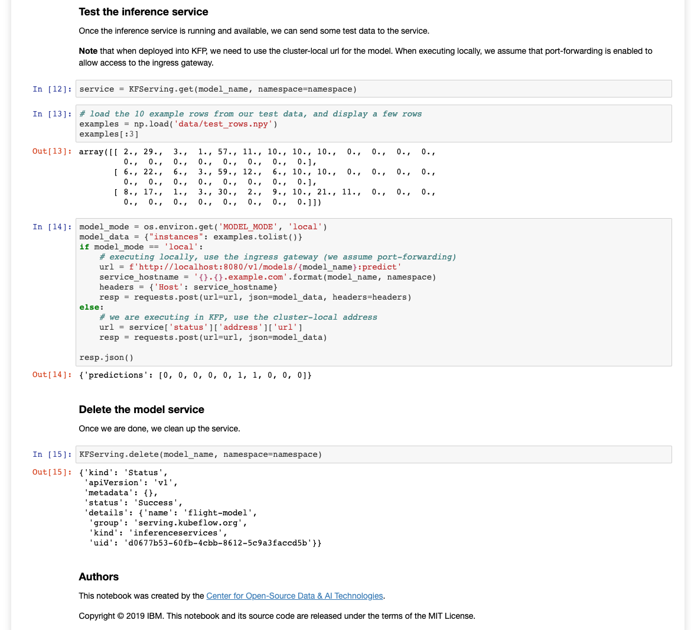

# Model deployment using KFServing

The `pipelines` folder contains a pipeline - `flight_delays_with_deployment.pipeline` - that encompasses deploying the trained flight prediction model as a service running in [KFServing](https://www.kubeflow.org/docs/components/serving/kfserving/). In order to run this version of the pipeline, you will need to setup KFServing.

**Note** this example uses the built-in `minio` object storage service within Kubeflow Pipelines as the storage location for deploying a model to KFServing. Hence, KFP is required unless you manually setup up minio, or use S3.

Once KFServing is set up, you can run the pipeline locally or using the KFP runtime, in the same way as the pipeline that excludes the model deployment step.

### Configuring a local KFServing runtime

Follow these steps to configure your KFServing runtime:

#### Install KFServing

Install KFServing locally on an existing Kubernetes installation, using [these instructions](https://github.com/kubeflow/kfserving/tree/cd53eb10fc6cf52edb9e6623238ed9aa9fe5af72#install-kfserving-in-5-minutes-on-your-local-machine). You may optionally also have Kubeflow Pipelines installed (see the [main README instructions](../README.md#configuring-a-local-kubeflow-pipeline-runtime)).

#### Set up access to object storage

Once installed and running, you will need to set up a `Secret` and `ServiceAccount` to allow KFServing to access the object storage bucket for the model (refer to [these instructions](https://github.com/kubeflow/kfserving/tree/master/docs/samples/s3#create-s3-secret-and-attach-to-service-account)).

**Note** we use the `kubeflow` namespace, since the model deployment node within a KFP runtime is not able to create resources in another namespace.

Run the following command on the command line:

```console
cat <<EOF | kubectl apply -f -
apiVersion: v1
stringData:
  AWS_ACCESS_KEY_ID: minio
  AWS_SECRET_ACCESS_KEY: minio123
kind: Secret
type: Opaque
metadata:
  annotations:
    serving.kubeflow.org/s3-endpoint: minio-service.kubeflow:9000
    serving.kubeflow.org/s3-usehttps: "0"
  name: kfserving-secret
  namespace: kubeflow
---
apiVersion: v1
kind: ServiceAccount
metadata:
  name: kfserving-sa
  namespace: kubeflow
secrets:
- name: kfserving-secret
EOF
```

#### Use a custom image for model server

By default, KFServing's model server for scikit-learn models - the `sklearnserver` - uses an image that runs sklearn version `0.20`. So, we need to use a custom image that runs sklearn `0.23`.

To do this, we follow the instructions [here](https://github.com/kubeflow/kfserving/tree/master/docs/samples/sklearn#run-sklearn-inferenceservice-with-your-own-image). Once KFServing is running, edit the `configmap`:
```console
kubectl edit cm -n kfserving-system inferenceservice-config
```

This will open the default editor with the configmap file. Change the entry for `sklearn` under `predictors` to:

```
"sklearn": {
  "image": "docker.io/mlnick/sklearnserver",
  "defaultImageVersion": "latest"
},
```

Save and exit the editor.

#### Update the pipeline-runner role

The Kubeflow pipeline-runner service account role must be updated so that it can create KFServing `inferenceservices`.

Edit the `role`:

```console
kubectl edit role -n kubeflow pipeline-runner
```

This will open the default editor with the role file. Add the following entry at the end of the file (after the last `apiGroups` entry):

```
- apiGroups:
  - serving.kubeflow.org
  resources:
  - inferenceservices
  verbs:
  - '*'
```

Save and exit the editor.

### Run the pipeline

You can now run the `flight_delays_with_deployment.pipeline` either locally or with the KFP runtime.

#### Running locally

Ensure that you set up port-forwarding for the Istio ingress gateway so that your deployment notebook can reach the deployed inference service. Run:

```console
kubectl port-forward -n istio-system svc/istio-ingressgateway 8080:80
```

#### Running in Kubeflow Pipelines

Sending requests to the inference service uses a different url and request structure, depending on whether you're using the ingress gateway or sending the request within the cluster (which will be the case if executing on a KFP runtime). In this case, set the Elyra node environment variable `MODEL_MODE=kfp`, in the node `Properties` dialog:



Once completed, you should be able to view the pipeline in the Kubeflow Pipelines UI:



You can also see the deployment notebook results by downloading the `html` file from object storage.

